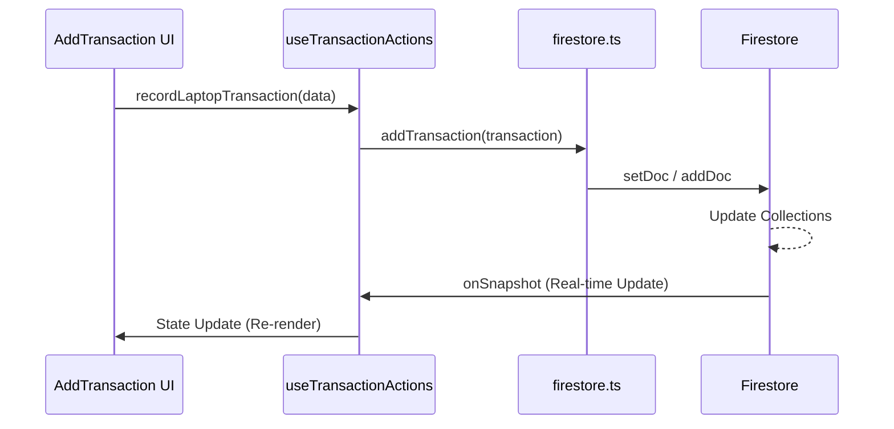

# OmniFlow Ledger Application Blueprint

This document serves as the architectural map for the OmniFlow Ledger application. It outlines the structure, data flow, and separation of concerns between core logic and the UI.

## 1. Architecture Overview: Separation of Concerns

The application follows a strict separation between **Core Logic** and **UI Components**.

- **UI Layer (`/src/components`)**: Purely responsible for rendering and user interaction. It consumes data and functions provided by hooks.
- **Logic Layer (`/src/hooks`)**: Contains the "brain" of the application. Manages state, handles form logic, and orchestrates actions.
- **Service Layer (`/src/services`)**: Handles direct communication with external services (Firebase/Firestore).
- **Data Layer (`/src/types.ts`, `/src/constants.ts`)**: Defines the shapes of data and initial states.

---

## 2. Directory Structure

```text
/src
├── components/          # UI Components (React)
│   ├── ui/              # Reusable Shadcn/UI components
│   ├── Navigation.tsx   # App sidebar/tabs
│   ├── Dashboard.tsx    # Stats and overview
│   └── ...              # Other feature components
├── hooks/               # Core Logic (Custom Hooks)
│   ├── useAppLogic.ts   # Main orchestrator
│   ├── useInventory.ts  # Central state management (Stock/Batches)
│   ├── useTransactionActions.ts # Core DB write operations
│   └── ...              # Feature-specific logic hooks
├── services/            # External Services
│   └── firestore.ts     # Low-level Firestore CRUD operations
├── firebase.ts          # Firebase initialization
├── translations.ts      # Multi-language support (EN, MS, ZH)
├── types.ts             # TypeScript interfaces and types
└── constants.ts         # Global constants and initial states
```

---

## 3. Data Flow & Communication

### How they talk to each other:

1.  **UI → Hook**: Components call functions from hooks (e.g., `handleRecord()`).
2.  **Hook → Service**: Hooks call service functions (e.g., `addTransaction()`).
3.  **Service → Firestore**: Services perform the actual network request.
4.  **Firestore → Hook (Real-time)**: `useInventory` listens to Firestore changes via `onSnapshot` and updates the global state.
5.  **Hook → UI**: Components re-render automatically when the hook's state changes.

### Diagram: Transaction Flow



---

## 4. Database & Services (`/src/services/firestore.ts`)

- **Source of Truth**: Firestore is the authoritative source for all stock, batches, and transactions.
- **Collections**:
    - `stock`: Current laptop inventory.
    - `componentStock`: Current component inventory.
    - `batches`: Grouped laptop items.
    - `transactions`: Historical log of all changes.
    - `users`: User profiles and roles (Admin vs. Basic).

---

## 5. Core Logic (Hooks)

### Global State (`useInventory.ts`)
- Manages the real-time synchronization of `stock`, `componentStock`, and `batches`.
- Provides the data used by almost every component.

### Actions (`useTransactionActions.ts`)
- Contains the "Write" logic.
- Handles the complex math of updating inventory when a transaction is recorded (e.g., adding 5 laptops to a batch).

### Authentication (`useAuth.ts`)
- Manages user login state and Role-Based Access Control (RBAC).
- Determines if a user `isAdmin` or `isUltimateAdmin`.

---

## 6. UI Layer (`/src/components`)

- **Conditional Rendering**: Components check `isAdmin` to show/hide restricted actions (Undo, Edit, User Management).
- **Translations**: Uses the `t` object from `translations.ts` for all text, supporting English, Malay, and Chinese.

---

## 7. Future Updates

- **Before every update**: Read this blueprint to ensure the new code respects the existing architecture.
- **After every update**: Update this blueprint if new directories, core hooks, or major data flows are introduced.
