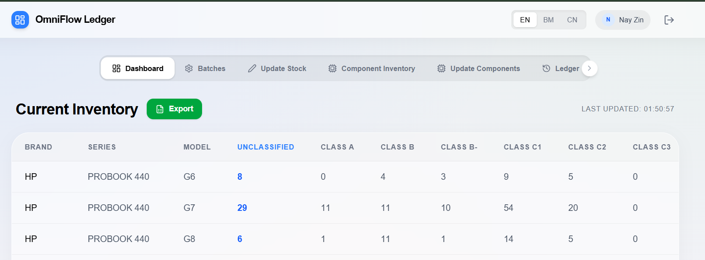
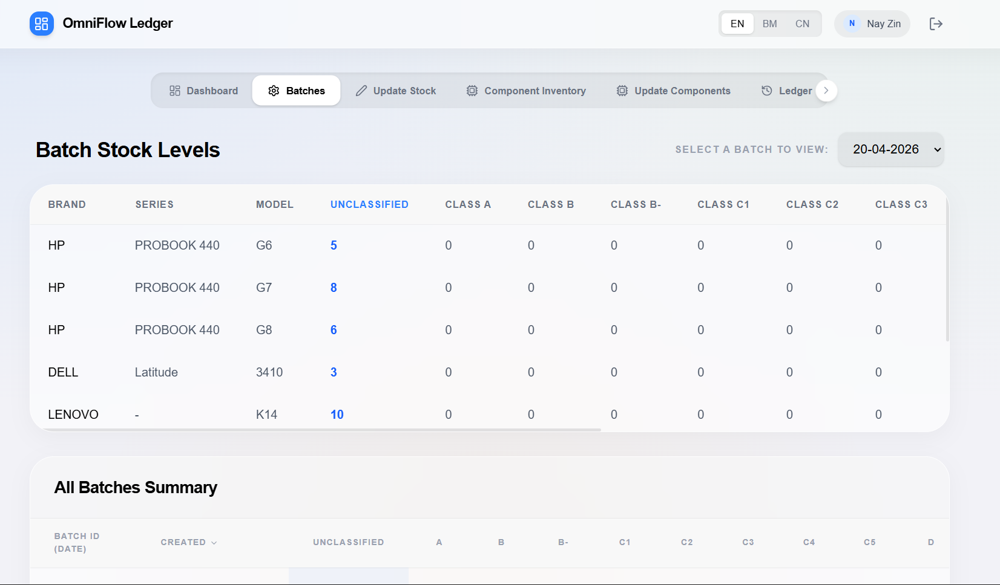
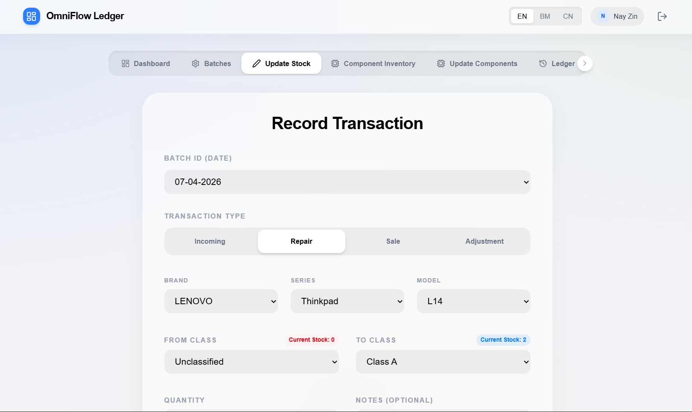
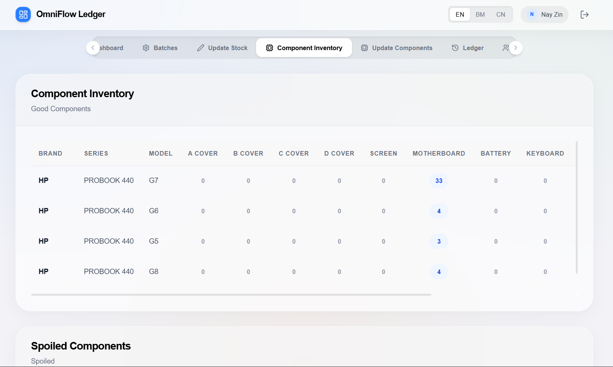
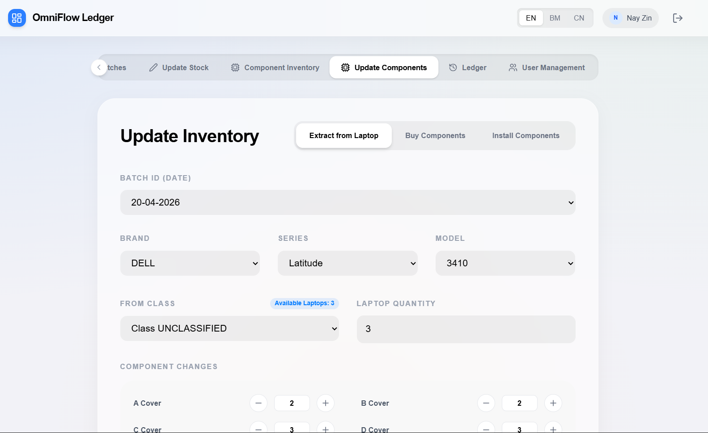
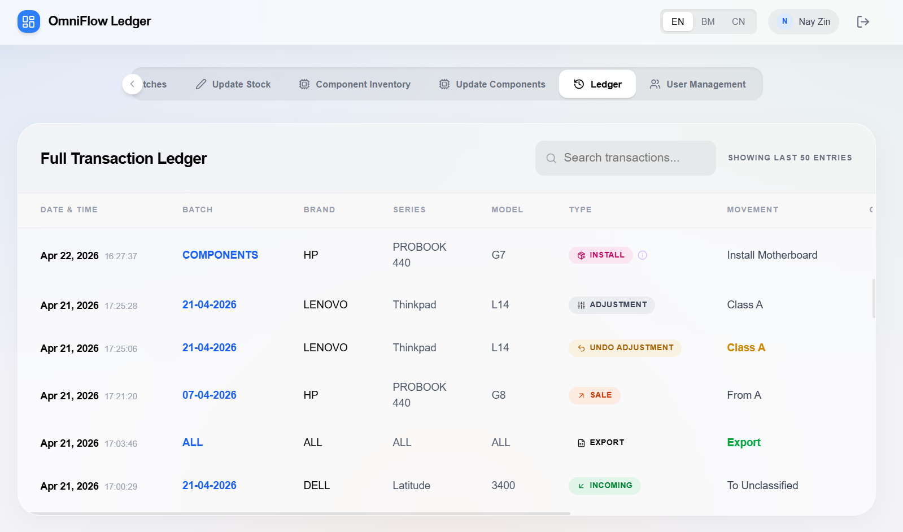
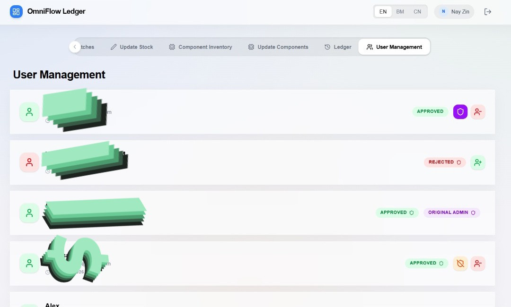

# Laptop Repair Shop Inventory Management System

A comprehensive, real-time inventory management web application tailored specifically for laptop repair shops, refurbishers, and IT asset disposition (ITAD) businesses. This system provides an elegant, iOS-inspired interface to track laptop stock, component inventory, and repair workflows.

## 🎯 Target Audience

This application is perfectly suited for:

- **Laptop Repair Shops:** Track incoming broken laptops, manage repair components, and record sales of refurbished units.
- **IT Refurbishers:** Manage batches of incoming laptops, classify them by condition (Class A, B, C, D, Spoiled), and track the extraction of good components from spoiled units.
- **Electronics Recyclers:** Keep a detailed ledger of parts harvested from recycled electronics.
- **Small to Medium IT Departments:** Maintain an internal inventory of spare parts and employee devices.

## ✨ Key Features

### Core Inventory Management

- **Laptop Stock Tracking:** Track laptops by Brand, Series, Model, and Condition Class (A, B, C, D, Spoiled).
- **Component Inventory:** Manage individual components (Screens, Batteries, Motherboards, RAM, SSDs, etc.) extracted from spoiled laptops or purchased new.
- **Batch Management:** Group incoming laptops into batches (e.g., by date or supplier) for easier tracking and reporting.
- **Transaction Ledger:** A complete, immutable history of all inventory movements (Incoming, Repair, Sale, Adjustment, Component Extraction, Component Installation).

### Advanced Capabilities

- **Component Extraction Workflow:** A dedicated UI to record the breakdown of spoiled laptops into reusable components, automatically updating both laptop and component inventories.
- **Component Installation Workflow:** Track the consumption of components when repairing or upgrading laptops.
- **Real-time Synchronization:** Powered by Firebase Firestore, ensuring all users see the most up-to-date inventory instantly.

### System Features

- **User Management & Authentication:** Secure Google Login integration. Administrators can approve new users and assign roles (Admin/User).
- **Multi-language Support:** Built-in internationalization (i18n) supporting English, Malay, and Chinese, making it accessible to diverse teams.
- **Responsive Design:** A mobile-first, iOS-inspired UI that works flawlessly on desktops, tablets, and smartphones.
- **Undo Functionality:** Administrators can undo recent transactions, automatically reverting the associated inventory changes.

---

## 🚀 Getting Started

### Prerequisites

- [Node.js](https://nodejs.org/) (v18 or higher)
- [npm](https://www.npmjs.com/) or [yarn](https://yarnpkg.com/)
- A [Firebase](https://firebase.google.com/) account

### 1. Firebase Setup

This application relies on Firebase Authentication and Firestore.

1. Create a new project in the [Firebase Console](https://console.firebase.google.com/).
2. Enable **Firestore Database** (start in production mode, we will set up rules later).
3. Enable **Authentication** and add the **Google** sign-in provider.
4. Register a Web App in your Firebase project to get your configuration object.

### 2. Local Installation

```bash
# Clone the repository
git clone <your-repo-url>
cd OmniFlow-Ledger

# Install dependencies
npm install
```

### 3. Environment Configuration

Create a `.env` file in the root directory based on `.env.example`. This application uses Vite environment variables for Firebase configuration:

```env
VITE_FIREBASE_API_KEY=your_api_key
VITE_FIREBASE_AUTH_DOMAIN=your_project.firebaseapp.com
VITE_FIREBASE_PROJECT_ID=your_project_id
VITE_FIREBASE_STORAGE_BUCKET=your_project.firebasestorage.app
VITE_FIREBASE_MESSAGING_SENDER_ID=your_sender_id
VITE_FIREBASE_APP_ID=your_app_id
VITE_FIREBASE_MEASUREMENT_ID=your_measurement_id
VITE_FIREBASE_FIRESTORE_DATABASE_ID=(default)
```

_Note: The `firebase-applet-config.json` file is no longer the primary source of configuration for builds, though it may still be used by local development tools._

### 4. Running the Development Server

```bash
npm run dev
```

The application will be available at `http://localhost:3000`.

---

## 🌐 Hosting & Deployment

### Option A: Automated Deployment (GitHub Actions)

This project is configured with a CI/CD pipeline that automatically builds and deploys your application to Firebase whenever you push to the `main` branch.

1.  **GitHub Secrets**: Add the following secrets to your GitHub repository (**Settings > Secrets and variables > Actions**):
    - `FIREBASE_SERVICE_ACCOUNT_LAPTOPREPAIRSHOP`: Your Firebase Service Account JSON key.
    - `VITE_FIREBASE_API_KEY`, `VITE_FIREBASE_AUTH_DOMAIN`, etc. (All variables listed in `.env.example`).
2.  **Push to Main**: Simply run `git push origin main`.
3.  **Monitor**: Check the **Actions** tab in GitHub to see the build and deployment progress.

### Option B: Manual Firebase Hosting (Recommended)

Since the app already uses Firebase for its backend, Firebase Hosting is the most seamless option.

1. Install the Firebase CLI: `npm install -g firebase-tools`
2. Login to Firebase: `firebase login`
3. Initialize hosting: `firebase init hosting`
   - Select your project.
   - Set the public directory to `dist`.
   - Configure as a single-page app (rewrite all urls to `/index.html`).
4. Build the project: `npm run build`
5. Deploy: `firebase deploy --only hosting`

### Option B: Vercel / Netlify

This is a standard Vite React application, which makes it incredibly easy to deploy on modern platforms like Vercel or Netlify.

1. Push your code to a GitHub repository.
2. Import the repository into Vercel or Netlify.
3. The platform should automatically detect it as a Vite project.
   - **Build Command:** `npm run build`
   - **Output Directory:** `dist`
4. Add your Firebase configuration as Environment Variables in the hosting platform's dashboard if you prefer not to commit the `firebase-applet-config.json` file (you will need to update `src/firebase.ts` to read from `import.meta.env` in this case).

---

## 📸 Screenshots

The screenshots below showcase the main features and user interface of the application, demonstrating its clean, iOS-inspired design and intuitive workflows.

### Dashboard



### Batches



### Update Stock



### Component Inventory



### Update Component



### Ledger



### User Management



---

## 🛡️ Security Rules

To ensure your data is secure, you must deploy Firestore Security Rules. A prototype `firestore.rules` file is included in the repository.

**Important:** The first user to log in with the email specified in the rules will be granted Ultimate Admin privileges. From there, they can approve other users via the User Management dashboard.

---

## 🛠️ Tech Stack

- **Frontend Framework:** React 18 with TypeScript
- **Build Tool:** Vite
- **Styling:** Tailwind CSS with `lucide-react` for icons
- **Backend & Database:** Firebase (Authentication, Firestore)
- **State Management:** React Hooks
- **Testing:** Vitest & React Testing Library

## 📝 License

This project is licensed under the MIT License - see the LICENSE file for details.
